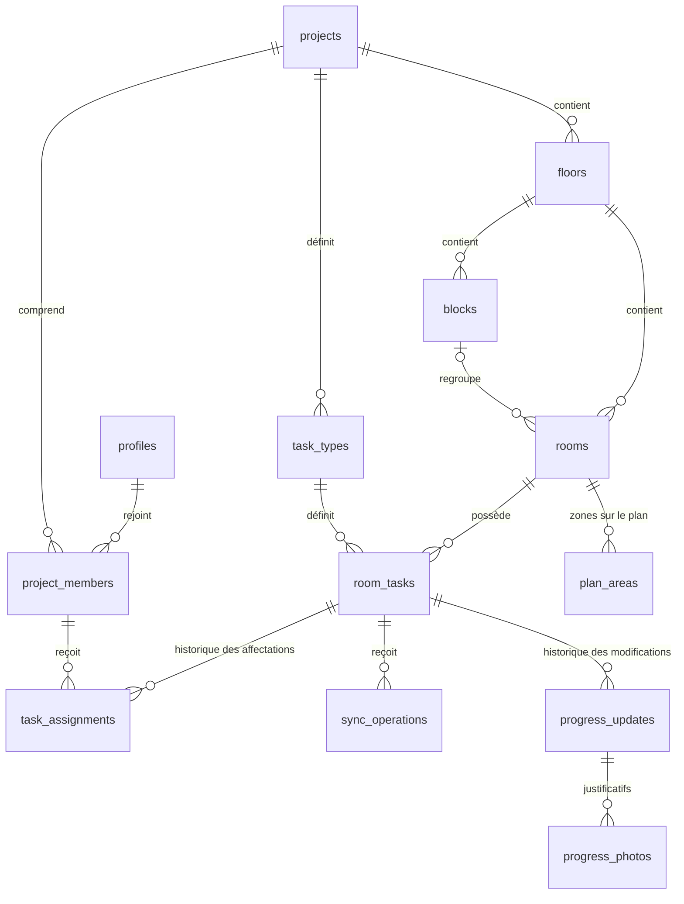

# Schéma de base de données — PISTACHE V2

> **Statut : proposition à revoir ensemble.** Ce document décrit le schéma envisagé ; il ne constitue pas une migration appliquée à la base.

Voici le **schéma proposé en français**. Les noms techniques des tables et des champs restent identiques pour pouvoir les retrouver facilement dans le code.

Le principe central : **chaque chambre possède ses propres tâches, créées à partir d’un catalogue commun au projet.**



## Conventions

- `uuid` : identifiant unique.
- `FK` : référence à une autre table.
- `?` : champ facultatif.
- `timestamptz` : date et heure avec fuseau horaire.
- `jsonb` : données structurées.

Sauf indication contraire, chaque table possède :

```text
id          uuid PRIMARY KEY
created_at  timestamptz DEFAULT now()
```

Toutes les tables rattachées à un projet possèdent également :

```text
project_id  uuid FK → projects
```

## 1. `profiles` — Utilisateurs

Contient les informations affichées dans l’application. Supabase Auth gère les identifiants de connexion, les mots de passe et les sessions.

| Champ | Type | Signification |
|---|---|---|
| `id` | uuid, PK → auth.users | Identifiant du compte |
| `display_name` | text | Nom affiché |
| `created_at` | timestamptz | Date de création |
| `updated_at` | timestamptz | Dernière modification |

Le rôle n’est pas enregistré ici : une personne peut être administratrice d’un projet et intervenante dans un autre.

## 2. `projects` — Projets

Exemple : **Mixed Use**.

| Champ | Type | Signification |
|---|---|---|
| `id` | uuid, PK | Identifiant du projet |
| `name` | text | Nom du projet |
| `description` | text | Description |
| `created_by` | uuid, FK → profiles | Créateur |
| `created_at` | timestamptz | Date de création |
| `updated_at` | timestamptz | Dernière modification |
| `archived_at` | timestamptz? | Date d’archivage |

Un projet archivé conserve ses données et son historique.

## 3. `project_members` — Membres et droits d’accès

Détermine qui appartient à un projet et ce que cette personne peut faire.

| Champ | Type | Signification |
|---|---|---|
| `project_id` | uuid, FK → projects | Projet concerné |
| `user_id` | uuid, FK → profiles | Utilisateur |
| `role` | text | `admin`, `worker` ou `viewer` |
| `status` | text | `active` ou `inactive` |
| `joined_at` | timestamptz | Date d’ajout au projet |
| `updated_at` | timestamptz | Dernière modification |

**Clé primaire :** `(project_id, user_id)`.

| Rôle | Droits proposés |
|---|---|
| `admin` — Administrateur | Gérer le projet, les membres, le catalogue et les affectations |
| `worker` — Intervenant | Consulter le projet et modifier ses tâches affectées |
| `viewer` — Lecteur | Consulter uniquement |

Un administrateur peut également recevoir des tâches. Désactiver un membre retire ses accès sans supprimer son historique.

## 4. `floors` — Étages

Champs supplémentaires aux champs communs :

| Champ | Type | Signification |
|---|---|---|
| `code` | text | Code stable, par exemple `r2` |
| `label` | text | Libellé affiché, par exemple `R+2` |
| `sort_order` | integer | Ordre d’affichage |
| `plan_storage_path` | text? | Emplacement du fichier du plan |
| `updated_at` | timestamptz | Dernière modification |
| `archived_at` | timestamptz? | Date d’archivage |

**Unicité :** `(project_id, code)`.

## 5. `blocks` — Blocs

Exemples : blocs **A**, **B** et **C** du R+2.

| Champ | Type | Signification |
|---|---|---|
| `floor_id` | uuid, FK → floors | Étage |
| `code` | text | Code du bloc |
| `label` | text | Nom affiché |
| `sort_order` | integer | Ordre d’affichage |
| `updated_at` | timestamptz | Dernière modification |
| `archived_at` | timestamptz? | Date d’archivage |

**Unicité :** `(floor_id, code)`.

## 6. `rooms` — Chambres

Chaque ligne représente une chambre indépendante.

| Champ | Type | Signification |
|---|---|---|
| `floor_id` | uuid, FK → floors | Étage de la chambre |
| `block_id` | uuid?, FK → blocks | Bloc, si applicable |
| `number` | text | Numéro : `201`, `202`, éventuellement `201A` |
| `room_type` | text? | Type : standard, junior, executive… |
| `sort_order` | integer | Ordre d’affichage |
| `updated_at` | timestamptz | Dernière modification |
| `archived_at` | timestamptz? | Date d’archivage |

**Unicité :** `(floor_id, number)`.

Le bloc sélectionné doit appartenir au même étage que la chambre.

## 7. `task_types` — Catalogue commun des types de tâches

Définit les travaux que l’on retrouve dans toutes les chambres du projet.

| Champ | Type | Signification |
|---|---|---|
| `code` | text | Identifiant métier, par exemple `paint` |
| `label` | text | Intitulé : « Peinture 1ère couche » |
| `zone` | text | `bedroom`, `bathroom` ou `loggia` |
| `group_label` | text | Groupe : peinture, plomberie, électricité… |
| `description` | text | Description du travail |
| `source_column` | text? | Colonne Excel d’origine |
| `sort_order` | integer | Ordre d’affichage |
| `updated_at` | timestamptz | Dernière modification |
| `archived_at` | timestamptz? | Date d’archivage |

**Unicité :** `(project_id, zone, code)`.

Les zones correspondent à la **chambre**, la **salle de bain** et la **loggia**.

Cette table ne contient ni avancement ni personne affectée.

## 8. `room_tasks` — Tâches propres à chaque chambre

C’est la table centrale. Exemple : **peinture de la chambre 201, réalisée à 60 %**.

| Champ | Type | Signification |
|---|---|---|
| `room_id` | uuid, FK → rooms | Chambre concernée |
| `task_type_id` | uuid, FK → task_types | Type de travail |
| `progress` | smallint | Avancement entre 0 et 100, initialement 0 |
| `blocked` | boolean | Tâche bloquée ou non |
| `note` | text | Observation actuelle |
| `start_date` | date? | Date de début |
| `end_date` | date? | Date de fin |
| `version` | bigint | Numéro de version, initialement 1 |
| `updated_at` | timestamptz | Dernière modification |
| `updated_by` | uuid?, FK → profiles | Auteur de la dernière modification |
| `archived_at` | timestamptz? | Date d’archivage |

**Unicité :** `(room_id, task_type_id)`.

Une chambre ne peut donc pas avoir deux exemplaires du même type de tâche.

Avec les données actuelles : **40 chambres × 70 types de tâches = 2 800 tâches individuelles**.

La création d’une chambre génère ses tâches. L’ajout d’un type de tâche au catalogue génère une tâche correspondante pour chaque chambre active.

## 9. `task_assignments` — Affectations des tâches

Conserve les affectations actuelles et passées.

| Champ | Type | Signification |
|---|---|---|
| `room_task_id` | uuid, FK → room_tasks | Tâche précise à réaliser |
| `assignee_id` | uuid, FK → profiles | Personne affectée |
| `assigned_by` | uuid, FK → profiles | Administrateur ayant effectué l’affectation |
| `ended_at` | timestamptz? | Fin de l’affectation |
| `ended_by` | uuid?, FK → profiles | Personne ayant clôturé l’affectation |
| `reason` | text | Motif de l’affectation ou du changement |

`created_at` correspond au début de l’affectation.

**Règle obligatoire : une seule affectation active par tâche.** Une affectation est active lorsque `ended_at` est vide.

Lors d’une réaffectation, le serveur clôture l’ancienne affectation, crée la nouvelle et augmente la version de la tâche dans une seule transaction.

## 10. `sync_operations` — Suivi des changements envoyés au serveur

Permet de synchroniser les modifications hors connexion sans les appliquer deux fois.

Ici, **l’identifiant `id` est généré sur l’appareil avant l’envoi**.

| Champ | Type | Signification |
|---|---|---|
| `room_task_id` | uuid, FK → room_tasks | Tâche modifiée |
| `assignment_id` | uuid, FK → task_assignments | Affectation utilisée lors de la saisie |
| `submitted_by` | uuid, FK → profiles | Auteur |
| `device_id` | uuid | Identifiant de l’appareil |
| `base_version` | bigint | Version connue au début de la modification |
| `depends_on_operation_id` | uuid?, FK → sync_operations | Modification précédente à traiter d’abord |
| `payload` | jsonb | Contenu de la modification |
| `client_created_at` | timestamptz | Date de saisie sur l’appareil |
| `status` | text | `accepted`, `conflict` ou `rejected` |
| `result_version` | bigint? | Version obtenue après acceptation |
| `error_code` | text? | Motif du conflit ou du refus |
| `processed_at` | timestamptz | Date de traitement par le serveur |

Renvoyer la même opération retourne son résultat précédent. Le serveur refuse la réutilisation du même identifiant avec un contenu différent.

Le serveur détermine lui-même l’auteur authentifié, le résultat et la nouvelle version.

## 11. `progress_updates` — Historique des modifications acceptées

Permet de savoir **qui a changé quoi, et quand**.

| Champ | Type | Signification |
|---|---|---|
| `room_task_id` | uuid, FK → room_tasks | Tâche concernée |
| `operation_id` | uuid?, unique, FK → sync_operations | Opération à l’origine du changement |
| `assignment_id` | uuid?, FK → task_assignments | Affectation concernée |
| `changed_by` | uuid?, FK → profiles | Auteur |
| `source` | text | `user` ou `import` |
| `previous_version` | bigint | Version précédente |
| `new_version` | bigint | Nouvelle version |
| `before_state` | jsonb | Valeurs avant modification |
| `after_state` | jsonb | Valeurs après modification |
| `correction_reason` | text? | `input-error` ou `scope-change` |
| `correction_note` | text? | Explication de la correction |

Les états avant/après comprennent l’avancement, le blocage, les observations et les dates.

**L’historique ne se réécrit pas.** Une correction ajoute une nouvelle entrée.

L’enregistrement de l’avancement, de son historique et du résultat de synchronisation se fait dans une seule transaction.

## 12. `progress_photos` — Photos justificatives

Prépare l’ajout de photos liées aux modifications d’avancement.

| Champ | Type | Signification |
|---|---|---|
| `progress_update_id` | uuid, FK → progress_updates | Modification justifiée |
| `storage_path` | text, unique | Emplacement de l’image |
| `uploaded_by` | uuid, FK → profiles | Auteur de l’envoi |
| `mime_type` | text | Format du fichier |
| `file_size` | bigint | Taille en octets |
| `captured_at` | timestamptz? | Date de prise de vue |
| `deleted_at` | timestamptz? | Date de suppression logique |

L’image est stockée dans un espace privé de **Supabase Storage**. Cette table contient ses références et ses informations.

## 13. `plan_areas` — Zones interactives du plan

Associe les formes du plan aux chambres.

| Champ | Type | Signification |
|---|---|---|
| `room_id` | uuid, FK → rooms | Chambre représentée |
| `zone` | text | `bedroom`, `bathroom` ou `loggia` |
| `source_layer` | text? | Calque d’origine dans le plan |
| `geometry` | jsonb | Forme ou ensemble de formes |
| `updated_at` | timestamptz | Dernière modification |

**Unicité :** `(room_id, zone)`.

Le plan affiche les avancements enregistrés dans `room_tasks`.

## Stockage local pour le travail hors connexion

Ces trois espaces seront enregistrés sur chaque appareil, dans **IndexedDB**, séparément pour chaque utilisateur connecté :

| Espace local | Contenu |
|---|---|
| `cached_data` | Projets, chambres, tâches, affectations et versions téléchargées |
| `outbox` | Modifications en attente, ordre d’envoi, tentatives et conflits |
| `pending_files` | Photos en attente d’envoi, si cette fonction est activée |

Une modification hors connexion existe d’abord dans `outbox`. Elle apparaît dans `sync_operations` une fois reçue et traitée par le serveur.

## Règles communes à toutes les tables

- Les références doivent rester dans le même projet.
- Seul l’intervenant actuellement affecté peut effectuer les modifications ordinaires d’une tâche.
- Les droits de correction administrative doivent être définis explicitement.
- Les permissions sont vérifiées par le serveur, même si la modification a été saisie hors connexion.
- Les accès aux données sont limités aux membres autorisés grâce aux règles **RLS** de Supabase.
- Les chambres et les tâches sont archivées pour conserver leur historique.
- Les versions du serveur déterminent si une modification est à jour ; l’heure de l’appareil sert uniquement d’information.

Pour la première version, la **gestion du projet et les affectations nécessiteraient une connexion**, tandis que la **saisie des avancements resterait possible hors connexion**.
